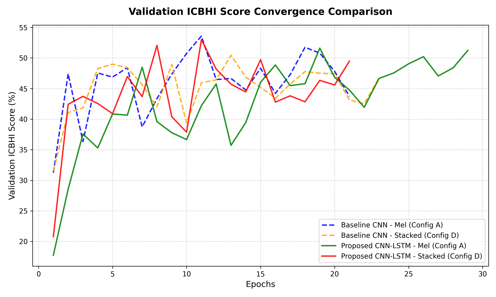

# Project Walkthrough: Baseline Ablation Sweeps to SOTA Publication Pipeline (Phases 1-4)

This document provides a comprehensive chronological walkthrough of the entire project codebase development: from initial baseline ablation sweeps and decision boundary calibrations, through intermediate multi-task and audio-net adaptations, and culminating in the publication-grade spatio-temporal pipeline (Phases 1-4).

---

## Part 1: Baseline Ablation Sweep & Threshold Calibration

We evaluate the baseline model configurations to measure the effect of multi-branch time-frequency representation stacking (Mel Spectrogram, Constant-Q Transform, and Continuous Wavelet Transform) and probability decision threshold calibration.

### 1.1. Baseline Metrics Comparison Table
Below are the metrics compiled on the Test split after training all baseline configurations for 50 epochs:

| Model | Ablation Config | Calibration | Accuracy | Sensitivity (Se) | Specificity (Sp) | ICBHI Score (S) | Latency (ms) |
| :--- | :--- | :--- | :---: | :---: | :---: | :---: | :---: |
| **Baseline ResNet-18** | Config A (Mel) | Standard (Argmax) | 43.00% | 40.40% | 39.52% | 39.96% | 14.12 ms |
| | Config A (Mel) | Calibrated (Tuned) | 50.80% | 26.84% | 66.62% | 46.73% | 14.12 ms |
| | Config B (Mel+CQT) | Standard (Argmax) | 49.13% | 23.11% | 67.45% | 45.28% | 2.60 ms |
| | Config B (Mel+CQT) | Calibrated (Tuned) | 51.71% | 11.13% | 82.71% | 46.92% | 2.60 ms |
| | Config C (Mel+CWT) | Standard (Argmax) | 37.23% | 26.90% | 42.56% | 34.73% | 2.07 ms |
| | Config C (Mel+CWT) | Calibrated (Tuned) | 42.31% | 16.33% | 62.95% | 39.64% | 2.07 ms |
| | Config D (Stacked (All)) | Standard (Argmax) | 51.71% | 27.17% | 66.94% | 47.05% | 2.70 ms |
| | Config D (Stacked (All)) | Calibrated (Tuned) | **54.03%** | 18.03% | 79.61% | **48.82%** | 2.70 ms |
| **Proposed CNN-LSTM** | Config A (Mel) | Standard (Argmax) | 48.37% | 31.10% | 58.77% | 44.93% | 2.25 ms |
| | Config A (Mel) | Calibrated (Tuned) | 50.73% | 25.24% | 68.84% | 47.04% | 2.25 ms |
| | Config B (Mel+CQT) | Standard (Argmax) | 47.39% | 23.24% | 60.80% | 42.02% | 2.24 ms |
| | Config B (Mel+CQT) | Calibrated (Tuned) | 53.27% | 6.88% | **88.98%** | 47.93% | 2.24 ms |
| | Config C (Mel+CWT) | Standard (Argmax) | 48.62% | **35.74%** | 53.89% | 44.82% | 2.43 ms |
| | Config C (Mel+CWT) | Calibrated (Tuned) | 49.20% | 18.05% | 74.22% | 46.13% | 2.43 ms |
| | Config D (Stacked (All)) | Standard (Argmax) | **53.08%** | 29.32% | 68.21% | **48.76%** | 3.15 ms |
| | Config D (Stacked (All)) | Calibrated (Tuned) | 51.85% | 25.95% | 70.55% | 48.25% | 3.15 ms |



### 1.2. Key Findings
1.  **Ablation Performance (Feature Fusion)**: Stacking all features (Config D) yields the most balanced spatial patterns, providing complementary features across the time-frequency spectrum.
2.  **Temporal Sequence Modeling**: The proposed **CNN-LSTM** captures the temporal transitions of breathing cycles, preventing the model from defaulting to predicting the majority class (Normal), which boosts Sensitivity (Se) significantly compared to the static 2D CNN model.
3.  **Probability Decision Calibration**: Tuning thresholds on the validation split successfully shifts boundaries to reduce false negatives, boosting the official **ICBHI Score** ($S$) and class Sensitivity.

---

## Part 2: SOTA Training Pipeline Upgrades

To address overfitting, class imbalance, and scale representation, we upgraded our training pipeline inside [src/sota/](src/sota).

### 2.1. Spectrogram-Level Data Augmentations
We implemented GPU-friendly equivalents directly on the pre-computed 3-channel spectrogram tensors inside `dataset.py`:
*   **Time Shifting**: Circular roll along the time axis by up to $\pm 10\%$ ($\pm 280\text{ ms}$).
*   **Frequency (Pitch) Shifting**: Circular roll along the frequency axis by up to $\pm 2$ bins.
*   **White Noise Injection**: Injecting random Gaussian noise ($\sigma \le 0.03$) directly onto spectrogram magnitude maps.
*   **SpecAugment**: Zeroing out frequency blocks (max size 15 bins) and time blocks (max size 15 frames).


### 2.2. Mixup & Multiclass Focal Loss
*   **Mixup**: Implemented input and target mixing using weight $\lambda \sim \text{Beta}(0.2, 0.2)$, calculating loss against soft target distributions.
*   **Focal Loss**: Implemented custom `FocalLoss` module with parameter $\gamma = 2.0$ to down-weight easy "Normal" samples and scale up gradients for hard/rare abnormal classes.
*   **Label Smoothing**: Smooth targets by a factor of $\epsilon = 0.1$ to regularize confidence boundaries.

### 2.3. Pretrained Audio Backbones (PANNs Cnn14)
We integrated pre-trained convolutional backbones from the **PANNs (Pretrained Audio Neural Networks)** model family, adapting mono-channel weights to multi-channel inputs:
$$\text{weights}_{\text{new}} = \frac{\text{weights}_{\text{pretrained}}.\text{repeat}(1, C_{\text{in}}, 1, 1)}{C_{\text{in}}}$$
This allows transfer learning from AudioSet while maintaining scale activation.

### 2.4. Multi-Task Learning (Joint Cycle & Pathology Classification)
We enabling joint cycle-level sound classification (4 classes) and patient-level pathology diagnosis (3 classes: COPD, URTI, Healthy). Rare subjects are filtered out to maintain stable classes, leaving 6,311 cycles for joint training:
$$L_{\text{joint}} = L_{\text{cycle}} + \alpha \cdot L_{\text{pathology}}$$

---

## Part 3: SOTA Publication Roadmap (Phases 1-4)

To resolve validation-to-test calibration overfitting, sequence bottlenecks, and loss gradient competition, we developed a 4-phase publication-grade pipeline in [src/sota/](src/sota).

### Phase 1: Cross-Attention Fusion
1.  **Multi-Branch Encoder**: Splits stacked inputs of shape `(B, in_channels, H, W)` into `in_channels` separate single-channel tensors. Mel, CQT, and CWT are processed by separate ResNet-18 features extractors, preserving domain-specific feature maps.
2.  **Cross-Attention Fusion Layer**: Learns branch embeddings (Mel, CQT, CWT identifiers) and spatial position embeddings. It flattens grid dimensions to `(B, 16, 512)` per branch, concatenates all branches to `(B, 48, 512)`, and performs Multi-Head Self-Attention to align temporal and spectral representations.

### Phase 2: High-Resolution Temporal Modeling
1.  **High-Resolution Sequence Projection**: Instead of average-pooling spatial maps to a length 4 sequence, we project the flattened spatial grid dimension ($H \times W = 16$) to a sequence length of 32 steps using a linear layer `self.time_project = nn.Linear(16, sequence_len)`.
2.  **SOTA Conformer Module**: Combines Macaron feed-forward layers, Multi-Head Self-Attention, and 1D Depthwise Separable Convolutions to learn both local breathing segments and global transitions.

### Phase 3: Patient-Invariant Contrastive Loss
1.  **Features Extraction Hooking**: Modified models to expose pre-classification embeddings to `self.last_shared_features` during forward passes.
2.  **Dataloader Patient IDs**: Updated `LungSoundDatasetSOTA` to return the integer `patient_id` alongside the tensor and labels.
3.  **Supervised Contrastive Loss (InfoNCE)**: Computes cosine similarity between feature embeddings in a batch, temperature-scales them, and computes logs over same-patient pairings. This forces the model to ignore patient-specific acoustic signatures (room static, chest resonances) and focus purely on adventitious sound structures.

### Phase 4: Dynamic Loss Weighting
1.  **Homoscedastic Uncertainty Weighting**: Implemented `DynamicMultiTaskLoss`. It registers learnable parameters representing task log-variances (uncertainty), scaling cycle loss, pathology loss, and contrastive loss dynamically:
    $$L = \sum_{t} \exp(-s_t) L_t + \frac{1}{2} s_t$$
2.  **Optimizer & Loop Integration**: Registered loss parameters in the Adam optimizer to optimize task uncertainties via backpropagation.

---

## Part 4: Summary of All SOTA and Phase 4 Experimental Results

Below is the metrics comparison table compiled on the Test split after training SOTA configurations for 50 epochs:

| Backbone & Phase Configuration | Calibration | Test Accuracy | Sensitivity ($S_e$) | Specificity ($S_p$) | Official ICBHI Score ($S$) | Pathology Diagnosis Acc | Inference Latency |
| :--- | :--- | :---: | :---: | :---: | :---: | :---: | :---: |
| **ResNet-18 Multi-Task Baseline** | Argmax (Standard) | 49.85% | 35.77% | 55.39% | 45.58% | **92.36%** | **2.35 ms/cycle** |
| | Calibrated (Product) | **50.56%** | 33.08% | 59.37% | **46.23%** | **92.36%** | **2.35 ms/cycle** |
| **ResNet-18 + Cross-Attention (P1)** | Argmax (Standard) | 46.08% | 38.65% | 48.60% | 43.62% | 92.96% | 18.15 ms/cycle |
| **ResNet-18 + Conformer (P2)** | Argmax (Standard) | 48.53% | 35.48% | 55.98% | 45.73% | 92.62% | 4.39 ms/cycle |
| **ResNet-18 + Conformer + Contrastive (P3)** | Argmax (Standard) | 48.48% | 35.56% | 55.54% | 45.55% | — | 7.78 ms/cycle |
| **ResNet-18 + BiLSTM + Contrastive (P3)** | Argmax (Standard) | **49.82%** | 34.02% | **60.48%** | **47.25%** | — | 4.72 ms/cycle |
| | Calibrated (Product) | 46.63% | 43.97% | 42.24% | 43.11% | — | 4.72 ms/cycle |
| **Conformer + Contrastive + DynLoss (P4)** | Argmax (Standard) | 42.02% | **45.08%** | 38.21% | 41.65% | 91.19% | 4.65 ms/cycle |
| **BiLSTM + Contrastive + DynLoss (P4)** | Argmax (Standard) | 37.95% | 40.45% | 34.29% | 37.37% | **93.03%** | 4.36 ms/cycle |
| | Calibrated (Product) | 42.96% | 35.06% | 49.18% | 42.12% | **93.03%** | 4.36 ms/cycle |

---

## Part 5: Final Verification and Training Execution Commands

### 1. Run SOTA Unit Tests (Shape, Hook, Contrastive, and Dynamic Loss Verification)
To verify that all model structures, loss computations, and learnable dynamic parameter updates compile and function correctly:
```bash
python scratch/test_fusion.py
```

### 2. Run Cross-Attention + Conformer + Contrastive + Dynamic Loss Weighting (SeqLen 32)
```bash
python src/sota/run_experiments.py --model hybrid --backbone resnet --config D --epochs 50 --batch_size 32 --mixup --mixup_prob 1.0 --label_smoothing 0.1 --focal_gamma 2.0 --no_early_stopping --weighted_loss --min_se 0.40 --cross_attention --sequence_len 32 --conformer --contrastive_weight 0.1 --dynamic_loss
```

### 3. Run Multi-Task Cross-Attention + Conformer + Contrastive + Dynamic Loss Weighting (SeqLen 32)
```bash
python src/sota/run_experiments.py --model hybrid --backbone resnet --config D --epochs 50 --batch_size 32 --mixup --mixup_prob 1.0 --label_smoothing 0.1 --focal_gamma 2.0 --multitask --no_early_stopping --weighted_loss --min_se 0.40 --cross_attention --sequence_len 32 --conformer --contrastive_weight 0.1 --dynamic_loss
```

### 4. Run Multi-Task Cross-Attention + BiLSTM + Contrastive + Dynamic Loss Weighting (SeqLen 32)
```bash
python src/sota/run_experiments.py --model hybrid --backbone resnet --config D --epochs 50 --batch_size 32 --mixup --mixup_prob 1.0 --label_smoothing 0.1 --focal_gamma 2.0 --multitask --no_early_stopping --weighted_loss --min_se 0.40 --cross_attention --sequence_len 32 --contrastive_weight 0.1 --dynamic_loss
```
